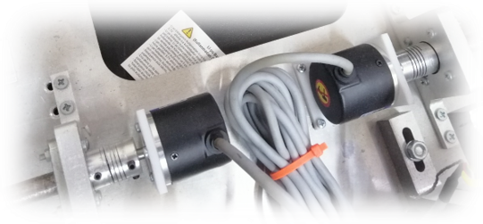

# Wheel Encoders

## Overview of Wheel Encoders

Wheel encoders are sensors commonly used in robotic applications to measure the rotational speed and number of rotations of a robot's wheels. The measured values are used to determine certain aspects of the robot's motion, making them particularly important for the odometry process, which is one of the data sources for localization.

## Wheel Encoders and Odometry

Odometry is the process of determining the current position by measuring and analyzing a robot's motion. Wheel encoders are used to determine how far the robot has traveled and in which direction. Wheel odometry, based on the information obtained from wheel encoders, is a primary component of our robot's localization and is crucial for accurate navigation and motion control. Through odometry, the robot can estimate its current position and orientation in the local plane, enabling it to position itself correctly relative to surrounding objects and move effectively.

## Limitations of Wheel Encoders

Wheel encoders face certain limitations, such as measurement errors and cumulative errors (accumulative errors). These challenges often manifest as measurement errors and cumulative errors and are typically the result of various environmental and mechanical factors.

Wheel slippage, rapid changes in speed, or lack of full contact between the wheel and the terrain can make it challenging for a wheel encoder to accurately measure rotations. Such errors directly affect the ability of encoders to provide accurate distance and speed measurements, which can negatively impact the robot's position estimation and navigation capabilities.

Additionally, wheel encoders are prone to cumulative error over time, which can reduce their long-term accuracy. The cumulative effect of these errors can pose problems, especially in long-duration and precision navigation tasks. As a result, regular verification of the data obtained from wheel encoders and error correction is necessary. It is not sufficient to rely solely on wheel encoders to accomplish a challenging task.

    

<em>Encoders' photo mounted to the mile of wheels</em>

