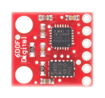

# Inertial Measurement Unit (IMU) Technology

## Features of a Six Degrees of Freedom IMU

The inertial measurement unit (IMU) we have chosen for our project is the SparkFun 6 Degrees of Freedom IMU Digital Combo Board - ITG3200/ADXL345 model. This feature-rich IMU consists of an accelerometer and a gyroscope component, providing the capability to detect motion in all three dimensions. This means that acceleration and rotational rate measurements can be performed along the three different axes (x, y, z).

The built-in ITG3200 gyroscope is used to measure the rotational rate, allowing the robot to detect roll, pitch, and yaw movements. In contrast, the ADXL345 accelerometer measures the linear accelerations of the robot in the x, y, and z axes. These linear acceleration measurements are used to determine the instantaneous velocity and direction of the robot. These six measurements are used to track the robot's motion in all dimensions and understand its current state in detail. The motion information obtained from these sensors forms the basis for more effective localization and mapping processes.

    

<em>IMU used in the vehicle</em>

## Usage of IMU in Robotics and Its Contribution to Localization and Mapping

Inertial measurement units (IMUs) play a critical role in providing odometry for robots. Odometry is the process of determining the current position and orientation by tracking the robot's motion. The IMU contributes to odometry by measuring the rotation and linear velocities of the robot.

IMUs not only contribute to the localization process but also aid in creating a detailed map of the environment. This holds true when specific digital algorithms are applied, and the IMU combines its data with other sensors that gather detailed information about the environment, making the mapping process more effective.

IMUs and wheel encoders are used together in the calculation of odometry. The cumulative errors in odometry obtained from wheel encoders over time can cause significant deviations in localization. To correct these errors, data obtained from the IMU is integrated with the wheel encoder data using a digital Kalman filter. This approach allows for the correction of accumulated errors in wheel encoders and provides more accurate odometry. An electronic configuration supported by IMU data can help the robot understand its environment from a broader perspective and even predict its future movements.

## Motivations for IMU Selection

The primary factor in selecting the IMU is to achieve more accurate localization through sensor fusion based on the features mentioned above. The main reason for choosing this particular model, the SparkFun 6 Degrees of Freedom IMU Digital Combo Board - ITG3200/ADXL345, is its precision, durability, and extensive functionality. The highly precise measurement capabilities of the ITG3200 gyroscope and ADXL345 accelerometer enable dynamic velocity measurements with high accuracy, even during complex robotic motions. These features contribute to the ability to comprehensively track all types of maneuvers and velocity changes made by the robot.

The selected IMU's wide operating range allows the robot to perform effectively in various environmental and operational conditions. This enables the robot to maintain odometry under different motion speeds and directions.

Furthermore, another important factor in the selection process is the capability of easily combining the precise outputs of the chosen IMU with encoder data to create a broader environmental information set. The IMU's precision also prevents it from being affected by vibrations generated by the mechanical parts of the vehicle during the mapping process, particularly in combination with LIDAR. These features led to the selection of this IMU model in line with the overall goals and requirements of our project.
