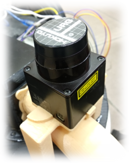
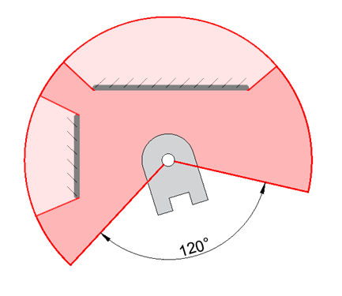

# LIDAR Technology

LIDAR (Light Detection and Ranging) is a technology that utilizes the lumination and reflection properties of light to precisely determine the locations and distances of objects in the environment. This advanced technology is utilized in a wide range of applications including automotive, weather monitoring, geology, and numerous other fields. In this section, we will focus on the application of 2-dimensional LIDAR, specifically discussing its critical impact on localization, mapping, and navigation. We will dive into the reasons behind choosing this specific LIDAR model for our project and will thoroughly discuss the existing and potential challenges and benefits this technology brings.

    

<em>Lidar mounted to the vehicle</em>

## Features of the LIDAR Used

The LIDAR model used in our project has key features like a scanning range of up to 5.6 meters, a scanning angle of 240 degrees, and a rapid response time. This maximum scanning range enables the vehicle to determine the positions and distances of surrounding objects with high accuracy. This results in a detailed understanding of the environment around the vehicle, thereby enabling it to navigate more effectively.

A scanning angle of 240 degrees provides a broad perspective of the environment. It allows the vehicle to monitor a larger area and respond more quickly and efficiently to potential hazards. A wide scanning angle enables the vehicle to observe a broad area and therefore receive early warnings. This in turn enables the development of a proactive strategy to prevent potential hazards or obstacles. Additionally, the high scanning speed and fast response time of this LIDAR model provide the ability to respond rapidly to instantaneous environmental changes. This is extremely valuable when moving in a dynamic environment, especially when we have to respond to moving obstacles or unexpected situations. This fast response time allows the vehicle to understand the world around it in real-time and respond swiftly.

The combination of these features greatly enhances LIDAR's environmental perception and navigation capabilities. These capabilities allow the vehicle to understand the world around it and move safely and effectively using this information. Therefore, LIDAR technology is of critical importance to the success of our project.

    

<em>Lidar's illustration sketch</em>

## Impact of LIDAR on Localization, Mapping, and Navigation

2D LIDAR technology plays a significant role in complex robotic applications, specifically in localization, environmental modeling (mapping), and path planning (navigation) processes. These processes are vital for a robot to understand its surroundings, position itself at a particular location, and move effectively towards a specific target. Integration of LIDAR with advanced robotic software frameworks such as the Robotic Operating System (ROS) further enhances and improves these processes.

Localization is the process by which a robot positions itself and objects in its environment in the physical world relative to a reference. LIDAR provides high-precision distance measurements, which are vital for this process. These measurements assist the robot in determining exactly where objects in its environment are and how it is positioned relative to these objects. LIDAR's continuous scanning ability enables the robot to respond quickly and effectively to continuously changing environmental conditions.

Mapping is the process where LIDAR data is used, and environmental information is organized into environmental models and maps. These maps help the robot understand the world around it and determine the most effective route towards a particular target. LIDAR plays a crucial role in creating high-resolution and detailed maps as it provides continuous and accurate information about objects in the environment. Furthermore, the optimization of the ROS library used during the mapping process is also a fundamental pillar of localization.

Navigation enables a robot to move most efficiently towards a specific target. LIDAR plays an important role in the navigation process by enabling the robot to understand the world around it and move safely within it. The continuous environmental scanning derived from the mapping process allows the robot to respond quickly and effectively to changes in its environment and integrate these responses into its navigation strategies.

The integration of these components demonstrates the significant impact of LIDAR on robot technologies, particularly when used in conjunction with advanced robotic software frameworks like ROS. It allows robots to move in a safer, more efficient, and predictable manner.

## Challenges of LIDAR Usage

While LIDAR technology offers numerous advantages for automation, it also presents some existing and potential challenges. For instance, the limitation of LIDAR's scanning capability to a single plane creates the risk of low-level obstacles and other potential hazards being overlooked by the robot. This can be a serious concern for the safety and operational efficiency of the vehicle, particularly in the presence of low-level obstacles. To overcome this limitation, the addition of an ultrasonic sensor system is planned. This additional sensor system will assist the LIDAR in detecting such obstacles.

## Reasons for Choosing LIDAR

LIDAR technology emerged as an ideal choice for our project due to a combination of its advanced features and the various advantages it offers for robotic applications. Firstly, high-precision distance measurements enable the robot to determine the positions and distances of surrounding objects quickly and accurately. This allows the robot to gain a broad perspective of its environment and effectively respond to variable environmental conditions, significantly enhancing environmental awareness and ensuring robot safety.

Secondly, the wide scanning angle of LIDAR allows the robot to monitor a larger area over longer distances. This enables the robot to obtain a broader pool of information about surrounding objects and helps in developing more effective and predictable navigation strategies.

Lastly, LIDAR technology is known for providing reliable and accurate measurements even in varying weather and lighting conditions. This makes it a technology that can effectively operate under any environmental conditions and meet the diverse requirements of our project.

In conclusion, the combination of these features and advantages clearly demonstrates why LIDAR is an ideal sensing technology for our project. The ability of the robot to understand its surroundings and respond to them in a safe and effective manner is of vital importance for the success of our project.
