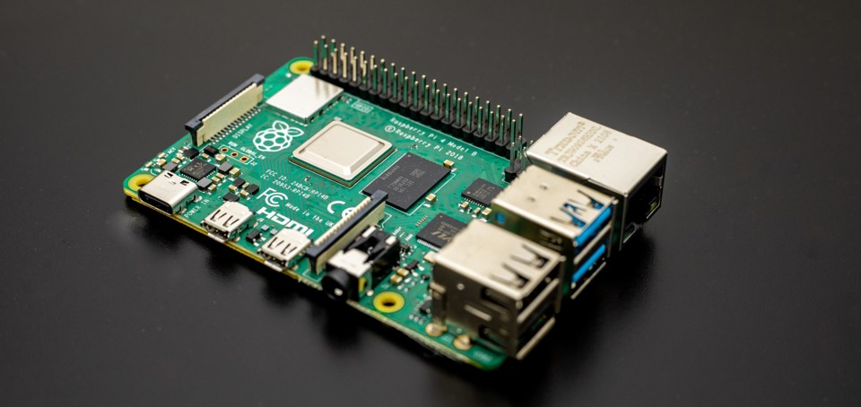
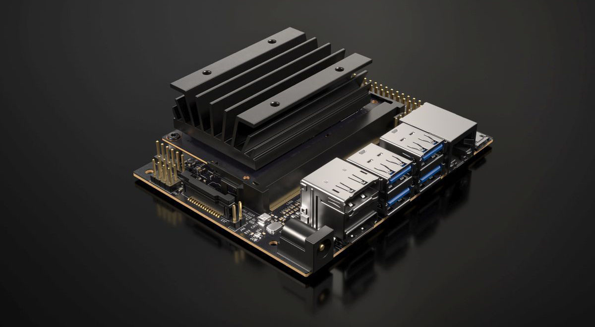

# Embedded Computer

## Raspberry Pi 3B

The core of robotic applications often consists of small-sized yet powerful embedded computers. For this project, we chose the Raspberry Pi 3B model due to its combination of speed, affordability, compact design, and various connectivity features.

The Raspberry Pi 3B offers high processing power with its quad-core 64-bit ARM Cortex-A53 processor running at 1.2 GHz. This processing power is sufficient to rapidly perform complex data processing and control tasks required by generic robotic projects.

Additionally, the Raspberry Pi 3B provides a platform with various connectivity options. Its built-in Wi-Fi and Bluetooth capabilities enable communication with environmental sensors and other network-connected devices. Furthermore, the Ethernet port and multiple USB inputs allow for flexibility in connecting additional devices and accessories.

    

<em>Raspberry Pi 3B photo by Jainath Ponnala</em>

The flexibility and processing power of the Raspberry Pi 3B make it an ideal platform for robotic prototyping. The use of an operating system-based development board facilitates more efficient and streamlined software development processes. The compatibility of the Raspberry Pi 3B with Linux-based operating systems provides access to a wide range of software and tools, enabling the development and implementation of control mechanisms and algorithms more effectively. The Ubuntu Server operating system is customized and optimized for this embedded computer, providing a lightweight Linux kernel tailored for robotic projects.

## Reasons for Selecting Raspberry Pi 3B and Future Plans

The high performance, affordability, compact size, and extensive connectivity options of the Raspberry Pi 3B make it an ideal choice as the embedded computer in this project. Moreover, the broad community support and compatibility of the Raspberry Pi 3B allow for easy adaptation and scalability if project requirements change in the future. The compatibility of Raspberry Pi 3B with the ROS software framework and its current processing power were considered sufficient for the prototype.

Furthermore, in the future stages of the project, transitioning to a more powerful embedded computer model is planned for advanced tasks. Specifically, models designed to support machine learning and computer vision applications by NVIDIA are considered, which would enable the robot to have more advanced features and capabilities.

    

<em>NVDIA Jetson Nano</em>

