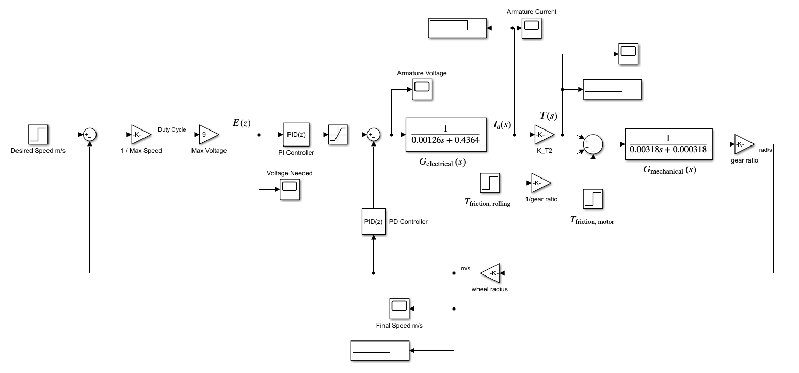

# Motor Control

Motor control is a crucial aspect of robotic systems, and it is responsible for the conversion of the commands given by the navigation system into actual movements of the robot's wheels. 

The speed signal produced in the navigation part is the tangential speed in a local axis set mounted on the vehicle and the angular speed in the z-axis. Based on this, we find parametrically what the speeds of the two wheels of the robot should be.

The control voltage required for this speed will be given to the DC motors, and power will be transmitted through the reductor to enable the wheels to move. To provide the control voltage to the motor, we use Pulse Width Modulation (PWM). 

PWM is a method that helps us control the voltage across the DC motor. It allows us to easily adjust the amount of power delivered to the motors, which in turn controls the speed of the wheels.

    

<em>Motor Control Schematic</em>

The control signal is produced with a digital PI-PD controller in Arduino. This controller uses proportional-integral-derivative control, which enables us to maintain precise control of the robot's speed and direction.

The motor is driven through the motor driver between 0 and 9 volts. This control scheme ensures that the motors receive the correct voltage necessary to attain the desired speed. This voltage is directly proportional to the speed signal obtained from the navigation system.

Here is a visual representation of the motor control process:

    

<em>Simulink Block Diagram</em>

After being controlled, we can see that the controller is successful by looking at the wheel speed graph produced in real-time by the system.

    

<em>Real-time Wheel Speed Graph</em>

This overview provides a clear understanding of the motor control process involved in the operation of the robot. With robust and precise motor control, the robot can effectively navigate through its environment according to the path planned by the navigation system.

**For more detailed information** about the control structure, please navigate to the [Electronics/Control repository](../Electronics/Control/README.md).
