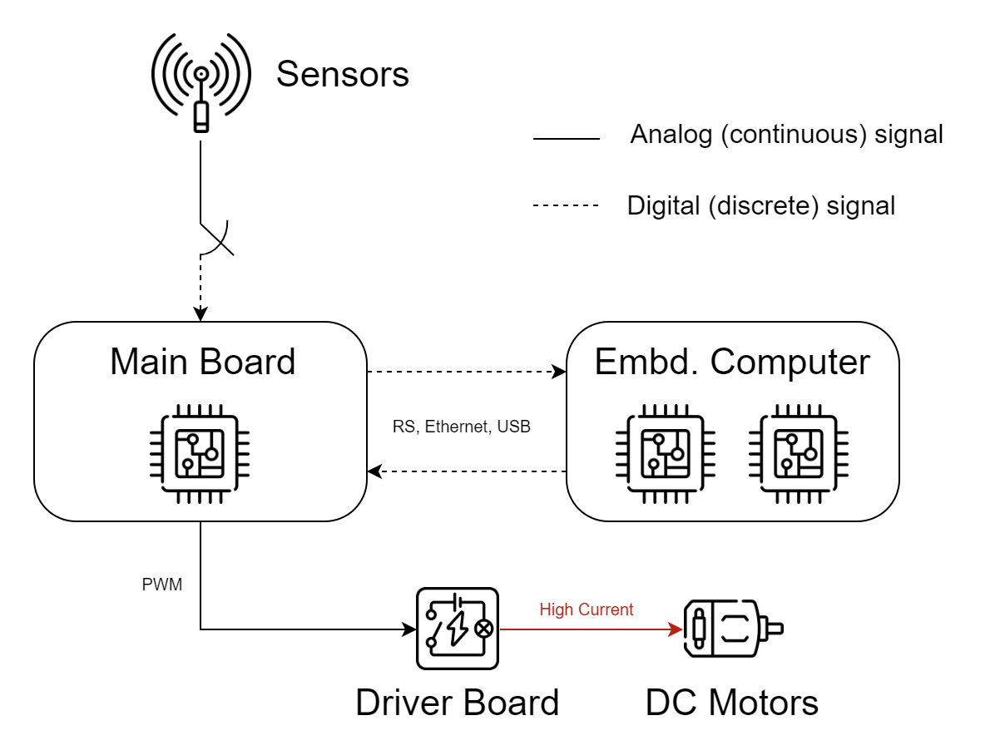

# Core Electronic Equipment Overview

For the prototyping phase, the creation of DustBusterAI involved designing electronic hardware configuration including sensors, drivers, microcontrollers, embedded computer etc. to maximize the use of existing technologies and opportunities. Each component plays a significant role in the various functions of the robot and is meticulously chosen to accommodate the specific operational requirements of the robot. These electronic systems contribute to the efficient functioning of the robot by effectively supporting a range of functions such as precise navigation, control, data processing, and connectivity.

For the effective and reliable operation of DustBusterAI, hardware components have been carefully selected within capabilities. These include:

- **Hokuyo-URG04LX-UG01 Lidar**: An indispensable sensor for autonomous vehicles for creating a 2D map of the environment and obstacle detection, Lidar is the chief architect of localization and mapping according to the algorithms applied and greatly assists in navigation. The Hokuyo URG-04LX-UG01 model scans around with a narrow-angle beam and measures collision distances, thus performing obstacle detection and mapping of the environment. In addition to being a compact, affordable, and reliable choice for indoor robotic applications, it stands out with its fast response time and low power consumption features.
  
- **SparkFun 6 Degrees of Freedom IMU Digital Combo Board - ITG3200/ADXL345**: IMU (Inertial Measurement Unit) is used in estimating orientation, which is important for accurate robot positioning. This 6-axis (3-axis gyro + 3-axis accelerometer) sensor board provides roll, pitch, and compass data, helping maintain the stability of the robot. Additionally, it is determined whether the robot is moving accurately and positioned properly using these data. The main duties of the IMU in the system are to contribute to accurate localization and monitor the performance of the robot.
  
- **Wheel Encoders**: Encoders are used for odometry to track the distance each wheel covers. High-resolution wheel encoders can accurately measure each turn of the wheels, even a portion of a turn. This data is important for motion control and position determination, as it helps determine exactly where the robot is and which direction it is moving in.
  
- **Motor Drivers**: Motor drivers control the operation of electric motors based on input signals. They provide the electrical current necessary to determine the speed and direction of the motor. They are of great importance in controlling the speed and direction of the robot with low voltage control signals, providing the precise control necessary to ensure the robot moves at the desired speed and in the correct direction. During the prototyping phase, the L298N double motor driver is used, but a standalone driver board is being considered for the future.
  
- **Arduino Mega**: As main board, Arduino Mega, used for communication between sensors and the computer, motor control, and power management, is a versatile and reliable microcontroller suitable for rapid prototyping. Its wide input/output capacity and high processing power make managing multiple sensors and actuators easier. A custom circuit board design is planned to replace Arduino Mega to gain greater control over the design for future versions of the robot.
  
- **Raspberry PI 3B**: As an Embedded Computer, Raspberry Pi 3B is used as the main embedded computer running ROS2. It manages advanced path planning, decision-making, and motion control algorithms, and plays a central role in the operation of DustBusterAI. Raspberry PI is currently sufficient, but we plan to include more advanced embedded computers like NVIDIA models to increase computing power and performance in the advanced versions of the robot, as we want to include machine learning and image processing algorithms.

An integral part of DustBusterAI's powerful operation is the precise positioning and mapping obtained by combining data from Lidar, IMU, and wheel encoders. This merging process brings together the power of each sensor, significantly reducing the impact of individual sensor limitations. While Lidar provides detailed environmental data, the IMU offers fast, relative motion information, and wheel encoders provide covered distance data. 

In future versions of the project, we plan to use an ultrasonic sensor system to avoid low obstacles for better navigation. Ultrasonic sensors are a technology that measures the distance and position of objects in the environment using high-frequency sound waves. These sensors will be used to detect low obstacles under the robot and enable the robot to successfully overcome these obstacles. The ultrasonic sensor system will integrate with existing sensors and improve the navigation performance of the robot, providing more precise and secure movement. Thus, future versions of DustBusterAI will offer an efficient cleaning experience by detecting obstacles more effectively.

In conclusion, DustBusterAI represents a versatile and inseparable aspect, combining electronic hardware, a range of sensors, microcontrollers, and additional hardware. The continuous development and integration of these electronic systems will play a significant role in the development of DustBusterAI. Thus, DustBusterAI will continue to evolve as an advanced, efficient, and reliable cleaning solution in the future.

<em>Roughly outlined hardware configuation of the robot</em>

---
**Note that** above and further electronics documentation in this repository are a part of general overview. More detailed documentation about electronics such as fully hardware configuration can be accessed through the Electronics repository of this project below.

[DustBusterAI-Electronics](https://github.com/onur-ulusoy/DustBusterAI-Electronics)