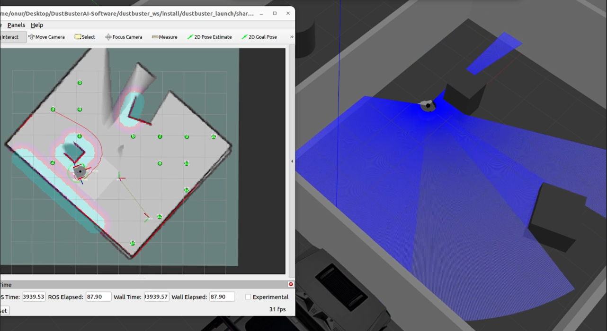

# Project Overview

## Introduction

In response to the need for efficient and effective cleaning solutions in large areas such as airports, **DustBusterAI** presents an innovative approach by integrating AI-powered robotics and mechatronics. 

**DustBuster**, the project's centerpiece, is a fully autonomous differential vehicle robot. It is designed for optimal performance, navigating complex environments while avoiding obstacles, and ensuring comprehensive coverage with its integrated cleaning system.

## Key Features

- **Advanced Navigation:** DustBuster leverages advanced path planning, decision-making, and motion control algorithms. 
- **Efficiency:** The robot's powerful electric motors and durable wheels facilitate rapid and efficient movements across large areas.
- **Reliability:** DustBuster's vehicle electronics are designed for efficiency and reliability, with particular attention paid to power management, thermal management, and fault tolerance design.

## Technical Details

DustBusterAI leverages the **Robot Operating System 2 (ROS2) framework** to implement AI-based cleaning solutions for the robot. It employs simulation and monitoring platforms, **Gazebo** and **RViz**, for efficient development. 

The project's robotic algorithms, developed primarily in **Python** and **C++** using ROS2 Humble, run on an embedded computer. DustBusterAI is a comprehensive mechatronic system, incorporating various components such as embedded software, control systems, electronics, communication, and mechanics.

## Sustainability

DustBusterAI signifies an attempt to address real-world challenges by integrating state-of-the-art technologies. It brings together advanced robotics, AI, and mechatronic principles to revolutionize large-scale, labor-intensive cleaning tasks. 

Keeping sustainability in mind, DustBuster has been engineered with an emphasis on energy efficiency. Its power management system maximizes battery life, facilitating longer operational hours. Furthermore, the robot's AI algorithms have been optimized to reduce computational demands, contributing to energy conservation.

## Resilience

One of the distinguishing features of DustBusterAI is its in-built fault detection and recovery system. This resilience feature enables the robot to detect operational anomalies, thereby reducing the likelihood of unexpected downtime. The system is also capable of self-diagnosing and often rectifying faults automatically, minimizing the need for continuous human monitoring and intervention.

## Adaptability

Designed for adaptability, DustBusterAI employs advanced adaptive path planning algorithms to ensure seamless operation across a wide range of conditions. These control systems implemented with the ROS2 framework, provide the flexibility to meet the unique requirements of different environments. 

With this capability, DustBusterAI can easily be scaled up or modified, making it a versatile solution adaptable to varied operational demands. Its optimized control structures enables precise maneuvering, accurate path following, and efficient obstacle avoidance, making the robot proficient in its task of large-area cleaning. These control methods also contribute significantly to the robot's resilience, ensuring uninterrupted operation in changing or unforeseen circumstances.

<em>Simulation of robot in Gazebo platform</em>

