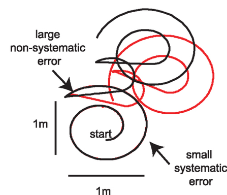

# Odometry

Odometry is the process of using data from motion sensors to estimate changes in position over time and generate output that determines the current position of a vehicle. It often involves analyzing information obtained from a robot's wheels or internal mechanics. The main goal of odometry is to determine the path or trajectory the vehicle has traveled and continuously update its current position. Odometry techniques are commonly classified as wheel odometry, visual odometry, and inertial odometry. Wheel and inertial odometry are important data sources for accurate localization and navigation and are used in combination.

## Wheel Odometry

Wheel odometry is the process of estimating the vehicle's position by analyzing data obtained from its wheels. This measurement process typically involves tracking the wheel rotations and converting these rotations into distance and angle. Wheel odometry is primarily used as the odometry source for differential-drive robots. Such robots determine the total distance traveled and the turning angle by using the wheel rotations. This information provides a precise estimate of the direction and instant position of the robot. It is essential for the accurate and up-to-date planning of the robot's path.

## Inertial Odometry

Inertial odometry is the process of estimating the vehicle's position by analyzing data obtained from inertial measurement units (IMUs). An IMU usually consists of an accelerometer, a gyroscope, and sometimes a magnetometer. The accelerometer measures acceleration along three axes, which is used for speed and position estimation. The gyroscope measures angular velocity and is used to track changes in the robot's orientation. The magnetometer is typically used to determine the robot's orientation in the world frame.

Inertial odometry can be useful when other localization systems such as GPS are unavailable or unreliable, such as in indoor environments or areas with unreliable GPS signals. In such situations, inertial odometry can provide a precise estimate of the direction and instant position of the robot. This information is crucial for effectively planning the robot's path and should be accurate and up-to-date.

## Limitations of Odometry

Odometry may not always provide completely accurate results due to a range of mechanical and physical limitations. One primary limitation is cumulative errors. These errors occur as small measurement errors accumulate over time, resulting in less accurate position estimates over time. Another limitation is friction and wheel slippage. Changes in surface friction or wheel slippage can lead to discrepancies between measured motion and actual motion, resulting in wheel odometry errors. Another limitation, particularly in inertial odometry, relates to sensor noise and accuracy. Sensors, especially in low-cost devices, can provide misleading information due to random errors and lack of precision. Being aware of these limitations and accounting for these factors is important for developing more accurate and reliable navigation systems. Multiple odometry sources are often used together to minimize these limitations.

    

<em>Cumulative Odometry Error by Location</em>

---

Image retrieved from:
Multi-Robot Searching with Sparse Binary Cues and Limited Space Perception - Scientific Figure on ResearchGate. Available from: https://www.researchgate.net/figure/Odometry-errors-A-Motion-capture-device-used-to-characterize-the-odometry-error-in-our_fig6_277943437 [accessed 30 Jun, 2023]