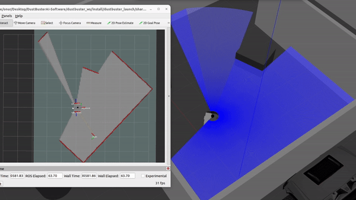

# Mapping

Mapping is the process that enables a robot to obtain detailed and accurate information about its surroundings. Mapping is crucial for a robot to move effectively, perform tasks, and interact with its environment. This information is particularly important for efficient navigation in complex or uncertain environments. In our system, we use the ROS2 Cartographer package for the mapping process. Cartographer is a package that provides 2D and 3D SLAM (Simultaneous Localization and Mapping) capabilities. The Cartographer package will be described in more detail in the following subsections.

## Mapping with ROS2 Cartographer

Using the ROS2 Cartographer package significantly enhances the accuracy and speed of the mapping process. Cartographer is particularly robust against sensor noise and environmental changes. This allows the robot to create high-quality maps even in uncertain and dynamic environments.

Another important feature of Cartographer is loop closure. This allows the robot to update its map and correct errors when it revisits a previously visited location. This feature improves the overall accuracy of the mapping and reduces navigation drift. It helps the robot provide more precise and reliable navigation.

**Note that** Cartographer creates and updates map every moment combining LiDAR and IMU data by the configuration. Sensor processing techniques and their effects to the software are also given in the documentations.

    

<em>Map View in RViz Created with Cartographer Algorithms</em>

## Impact of Mapping on Robot Operations

An accurate and up-to-date map enables the robot to function effectively. For example, the robot can navigate toward a goal along the most efficient route with the assistance of the map. This reduces energy consumption and improves the robot's efficiency.

Additionally, a detailed and up-to-date map allows the robot to interact with its environment more effectively. This enhances the robot's ability to detect and respond to environmental obstacles, even in dynamic environments. This is particularly important in situations where obstacles may arise unexpectedly or the environment is rapidly changing.

In conclusion, mapping with Cartographer adds significant value to robot operations. An accurate and up-to-date map improves the robot's ability to understand its surroundings, plan navigation paths, and effectively respond to obstacles.

For more detailed information about mapping with Cartographer, including its components, algorithms, and implementation details, please visit our Robotics repository.
