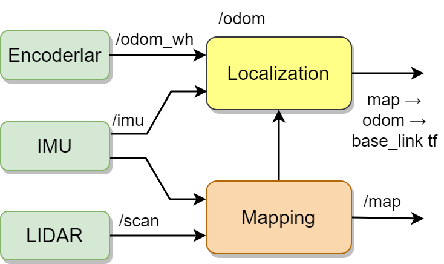
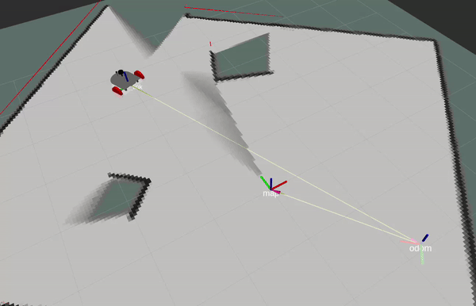

# Localization

Localization is the process of determining the position and orientation of a robot with respect to its surrounding world. Localization algorithms utilize position data predictions by filtering them to accurately determine the robot's position and orientation in real-time.

Various data sources can be used for localization, including Global Positioning System (GPS), vision-based sensors, sonar, and LIDAR. While GPS is suitable for outdoor environments, vision-based sensors and other detection technologies are generally more effective in indoor environments. However, since each source has its advantages and limitations, combining multiple data sources usually yields the most effective results.

In DustbusterAI, this version utilizes localization based on odometry and mapping data. Odometry tracks the robot's movement and continuously updates its position and orientation based on this information. Mapping helps the robot understand its surroundings and interact with the world. The combination of these two sources of information allows for a unified and accurate position estimation.

## Impact of Odometry on Localization

Odometry plays a fundamental role in the localization process, which involves determining the robot's own position and orientation relative to its environment. This process includes analyzing data from motion sensors, wheels, and internal mechanics.

Odometry tracks the robot's movements and collects data that determines the dimensions, speed, and direction of these movements. This information is then used to determine the robot's current position and movement direction. In particular, accurately tracking and updating the robot's motion and position is essential for precise navigation.

The data provided by odometry is continuously processed and analyzed by localization algorithms. These algorithms filter and interpret the incoming odometry data with respect to a predefined reference frame to assist in determining the robot's position in real-time. This process enables predicting the robot's position at a specific time, taking into account its movement direction and speed.

## Mapping and Localization

Mapping is another significant factor in determining the robot's position. A robot requires a map to understand and navigate its environment. The mapping process involves collecting environmental data perceived by the robot and transforming this data into a framework, usually a map.

Combining odometry and mapping often leads to more accurate and effective localization. This combination, often referred to as sensor fusion, involves integrating data from multiple sensors to achieve more accurate position estimation. While odometry data tracks the robot's own movement, mapping data provides information about the robot's surroundings. The fusion of these two sources enhances the robot's ability to determine its position and orientation.

    

<em>Localization Schematic</em>

## Localization Algorithms in ROS2

There are various localization algorithm packages available for Robot Operating System (ROS) 2. These packages include significant solutions such as Simultaneous Localization and Mapping (SLAM) and Google's Cartographer.

SLAM is a technique that allows robots to simultaneously determine their positions and map their environment in an unknown area. It is particularly useful when robots operate without knowledge of their environment or a predefined map. Many SLAM applications are available for ROS2, including popular ones such as Gmapping, RTAB-Map, and SLAM Toolbox.

Cartographer, developed by Google, is an open-source SLAM library that holds a significant position among SLAM technologies. Cartographer works seamlessly with ROS2 and offers simultaneous localization and mapping capabilities. It utilizes data from multiple sensor sources, including odometry, LIDAR, and IMU, to create 2D and 3D maps around the robot and determine its position. Cartographer is known for its ability to solve local and global SLAM problems at a large scale and is popular in various applications.

Both algorithms significantly enhance the ability of robots to map their surroundings and determine their position accurately. This helps robots navigate more effectively and interact with objects in their environment. It should be noted that the choice of the algorithm depends on the specific needs of the application and the environment in which the robot is used. 

Eventually, robot is localized in the way that necessary transforms between frames (map → odom → base_link) are created in every moment as can be seen in below.

    

<em>Transforms created by SLAM algorithms</em>

## ROS2 SLAM Package

As an application of Simultaneous Localization and Mapping (SLAM) technology, the ROS2 SLAM package is used for robots to simultaneously determine their positions and map their environment. This is particularly necessary for effective navigation and path planning in unknown environments. With this feature, the ROS2 SLAM package provides an ideal solution for robotic systems operating in both indoor and outdoor environments with variable and uncertain conditions.

### **Technical Details and Features**

The SLAM algorithm typically integrates various sensor data, including odometry and LIDAR sensors. The ROS2 SLAM package supports a wide range of sensors, which increases its applicability to various robotic platforms.

To resolve errors in odometry, the ROS2 SLAM package utilizes LIDAR data. LIDAR emits light waves to detect and measure distances to objects in the robot's surroundings. This data is used to improve the accuracy of odometry data and create an accurate environmental map.

The SLAM algorithm consists of two main steps: localization and mapping. Localization utilizes sensor data to estimate the robot's position in the world frame. The mapping step creates a map of the environment using sensor data. These two steps continuously follow each other, allowing the robot to continuously update its position and expand its knowledge about the environment.

The ROS2 SLAM package also possesses the ability to adapt to environmental changes. The algorithm detects changes in the environment and updates the map accordingly. This is particularly useful in dynamic environments where there are moving humans or vehicles.

Finally, the ROS2 SLAM package offers various tuning parameters to customize and adapt the algorithm to a specific application. These parameters can be used to optimize performance and accuracy. For example, sensor settings, map resolution, or adjustments to specific parts of the algorithm can be made.

### **Strengths and Applications**

One of the strengths of the ROS2 SLAM package is its environment modeling capability, with high accuracy and reliability. This is highly valuable in complex and variable environments. The package allows the robot to accurately model its surroundings by combining position estimation and environmental information.

The ROS2 SLAM package generally supports a wide range of sensors. This increases its applicability to various robotic platforms and applications. For example, the package can be used in aerial vehicles, ground vehicles, submarines, and even human-robot interactions.

Additionally, the ROS2 SLAM package quickly adapts to environmental changes. As the environment dynamically changes, the package updates its map, allowing the robot to have an accurate understanding of the new environment. This is particularly valuable in continuously changing environments, such as areas where humans or vehicles move.

However, there are also limitations and challenges in using the ROS2 SLAM package. In particular, its performance may decrease and result in incorrect maps in complex environments and cases with high sensor noise. This can affect the overall accuracy and reliability of the algorithm. Additionally, the ROS2 SLAM package generally requires high processing power, which can increase energy consumption and hardware costs.

Overall, the ROS2 SLAM package provides an effective solution when properly configured and used under suitable conditions. However, considering the challenges posed by complex environments and high processing power requirements, it may not always be the optimal choice for every application. Therefore, it is important to evaluate different navigation and mapping solutions based on the requirements and operational conditions of the robot,.

## ROS2 Cartographer Package

Cartographer, a prominent SLAM package within SLAM technologies, is an open-source SLAM library developed by Google. It seamlessly integrates with ROS2 and provides simultaneous localization and mapping capabilities based on SLAM technology. However, Cartographer offers several distinct advantages compared to the ROS2 SLAM package.

### **Notable Features and Advantages of Cartographer**

Cartographer stands out from other SLAM technologies by offering 2D and 3D mapping capabilities. This allows for more accurate and detailed maps to be created in complex and dynamic environments. Its effectiveness on both indoor and outdoor areas, flat and irregular surfaces, is a significant advantage.

Cartographer provides users with various tuning parameters to customize the package for specific applications or environments. These parameters can be used to adjust sensor settings, map resolution, or specific parts of the algorithm. This allows Cartographer to be optimized and deliver better performance for a particular task or environment.

When optimized, Cartographer provides a highly stable solution. It also responds quickly and effectively to environmental changes, which is particularly valuable in dynamic environments with moving objects. Its Loop closure feature stands out in the mapping section.

Finally, Cartographer's extensive parameter set allows customization and optimization for specific applications or environments. These parameters can be used to adjust sensor settings, map resolution, or specific parts of the algorithm.

### **Weaknesses and Limitations**

Cartographer also presents certain challenges. In particular, when not properly optimized, it may require high processing power and demand experience and expertise to correctly adjust various parameters. This can increase energy consumption and hardware costs. Additionally, in complex environments and situations with high sensor noise, Cartographer may generate incorrect maps.

## Overall Evaluation

Considering these features and advantages, the ROS2 Cartographer package proves to be a powerful and flexible tool for robotic navigation and mapping in complex environments based on SLAM technology. Therefore, we have chosen to use Cartographer instead of the ROS2 SLAM package.