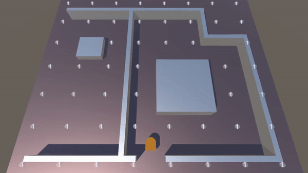
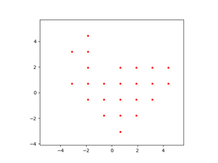
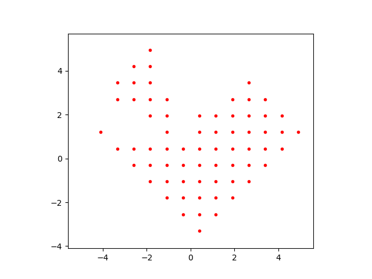
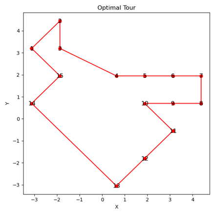
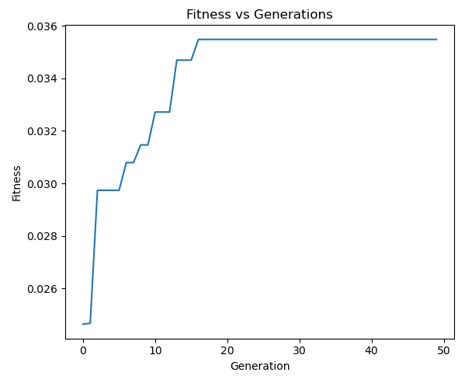
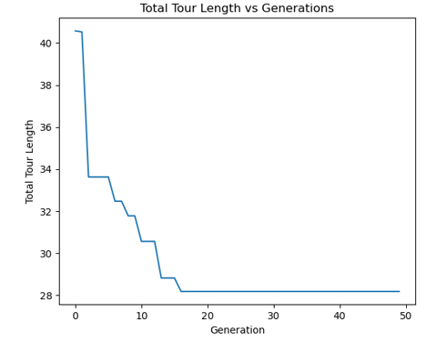
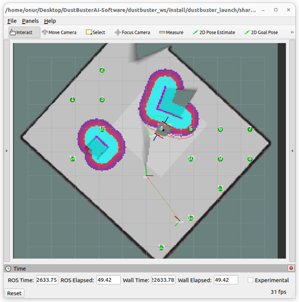

# Genetic Algorithm
Genetic algorithms are optimization algorithms designed to simulate the natural evolutionary process. They provide evolutionary solutions to problems and model the solution search process similarly to elements of biological evolution such as genes, individuals, populations, fitness values, and evolutionary mechanisms. The core principle of these algorithms is that solutions with higher fitness values are more likely to be selected and passed onto subsequent generations than solutions with lower fitness values.

## Working of a Genetic Algorithm
A genetic algorithm creates a population of potential solutions to solve a problem. These solutions are typically encoded as binary strings or other data structures. Each solution is considered an "individual", and each individual has a "fitness value". This fitness value indicates how well the individual's solution fits the problem.

The genetic algorithm evolves the population over a series of "generations". In each generation, individuals are selected and "mate" - a process through which they pass their genes to individuals of the next generation. Genetic operators, usually crossover and mutation, are used during this mating process. Crossover is the process of combining genes of two individuals, often occurring through a random point division and swapping of genes. Mutation is the process of making random, minor changes in an individual's genes.

Subsequent generations comprise the fittest individuals from the previous generation and newly formed individuals. The genetic algorithm repeats this process until a particular stopping criterion (for example, a certain number of generations or a specific fitness value) is met.

    

<em>TSP Problem Solved by Genetic Algorithm Visualized in Unity Platform</em>

## Limitations of Genetic Algorithms
Despite numerous strengths, genetic algorithms also come with a number of challenges and limitations. Firstly, the performance of genetic algorithms is often sensitive to the choice of specific parameters (population size, crossover and mutation rates, etc.). Proper tuning of these parameters can greatly affect the effectiveness and performance of the algorithm. However, determining the optimal values for these parameters is usually difficult and often done by trial and error. Hence, adopting an adaptive control technique for these parameters is planned for future versions.

Secondly, genetic algorithms often struggle to reach global optimization. This means that local optima in the solution space can deter the genetic algorithm from reaching the globally best solution. There are various techniques in genetic algorithms to maintain diversity and avoid getting stuck at such local best solutions, but it generally requires a delicate balance and is not an easy task. To overcome this problem, we usually try to diverge in local areas to reach the global area.

Lastly, genetic algorithms typically require a large amount of computational resources. A genetic algorithm must calculate the fitness function for each individual in the population, which can be time-consuming and resource-intensive, especially when dealing with large populations and/or complex fitness functions. However, in our case, it does not seem to cause much time and computational cost for local areas at the moment.

## Map Discretization and TSP
Map discretization is the process of transforming the map from a continuous space to a discrete space. This helps the robot identify areas to navigate around, thereby reducing computation and helping it make correct decisions without burdening the processor. Map discretization is usually performed by dividing the map into smaller cells or using a sampling-based approach. In our case, the map being processed is discretized with a dynamic sampling rate. This discretization process is used to determine where the robot can pass on the map. The process of extracting new discrete points continues at certain times to ensure the best cleanliness during the robot's operation.

At the planning stage, the current map perceived by the vehicle is saved as shown in the figure below.

    

<em>Saved map from vehicle's perception</em>

Afterwards, areas where the robot has not yet stepped on and can walk, in other words, will not be an obstacle or an unknown place, are discretized to a certain extent as shown in the figure below.

    

<em>Map after initial discretization with sampling parameter 15</em>

As the sampling parameter increases, more points are created.

    

<em>Map after initial discretization with sample parameter 25</em>

## Traveling Salesman Problem (TSP)
The discretized map is used to solve an optimization problem known as the Traveling Salesman Problem (TSP). TSP is a problem where a salesman needs to find the shortest route between cities. In this case, the "cities" are target points on the discretized map, and the robot needs to determine the shortest route that visits all points and returns to its starting position. The optimization of the path is done using the genetic algorithm. The fitness value for the TSP is calculated as the inverse of the total distance of the path. The objective of the TSP in our case is to clean all areas with the least amount of power. We have adopted a genetic algorithm because it can be used as an optimization method even if the TSP solution space is large.

## Genetic Algorithm We Developed for TSP Solution
The genetic algorithm we developed is used to solve the Traveling Salesman Problem (TSP). This algorithm allows for finding the shortest route between the set goals. These goals represent the points the robot needs to visit. The Nav2 package within ROS2 is used to determine the distances between goals during the operation of the genetic algorithm. Nav2 will be explained in detail in the other documentations.

During the solution search process, the genetic algorithm calculates the fitness values of different routes and enables the selection of the best path based on these values. The genetic algorithm forms a population, and each individual is considered as a path. The fitness value of each path, based on the total length of the path, is such that shorter paths will have higher fitness values.

In conclusion, the genetic algorithm repeats the solution search process, selecting the most suitable paths each time and creating new paths for the next generations. This process continues until the expected number of generations, predicted according to TSP complexity, is met. In this way, the shortest path between the goals for the robot is found. This determines how our robot will move most effectively between specific targets. The route created as a result of the genetic algorithm is handed over to navigation algorithms.

The genetic algorithm we developed is designed to work effectively in uncertain and changing environments. This allows the robot to adapt to any environment and situation. This allows the genetic algorithm to find effective solutions even in uncertain and variable environments. In future versions of the robot, we will use this algorithm a second time for a separate problem to obtain smarter solutions while discretizing the map.

## Algorithm Application
The best route through the formed points is found using a genetic algorithm, as described below.

At the beginning of the algorithm, random routes are generated. Routes with the shortest distances are selected by a certain percentage, and biological factors such as crossover and mutation are applied between them.

In the new generation, the most suitable ones are again selected, and this process is terminated when the length of the path falls below a certain value or stabilizes.

    

<em>Best route found using genetic algorithm</em>

As shown in the graph below, it is seen that saturation is reached in about 18 generations.

    

<em>Graph showing generations until saturation</em>

The following can be considered as an error graph. Approaching in this way, we can characterize the genetic algorithm as a form of a **biological control method**.

    

<em>Error graph of the genetic algorithm process</em>

Finally, the robot's navigation to the waypoints is performed as we see in the RViz image below.

    

<em>Robot navigates to waypoints one by one</em>

## Future Plans
In the next version of the robot, we aim to tackle map discretization as a problem, and later to solve it with a genetic algorithm based on the robot's cleaning capacity. Since we will develop a specific algorithm based on the vehicle's mechanical criteria and cleaning capacity, we leave this to future versions of the robot.
