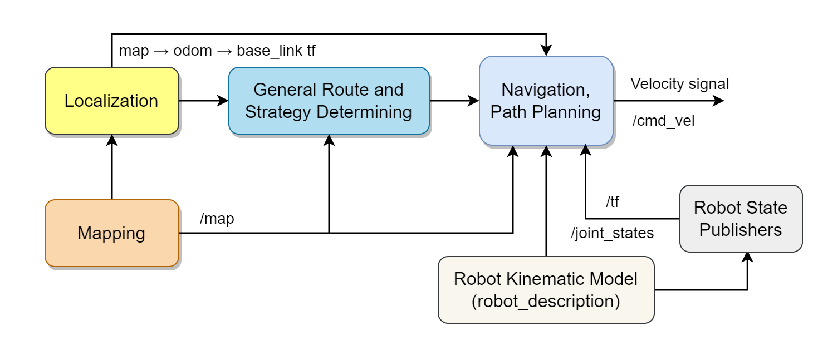
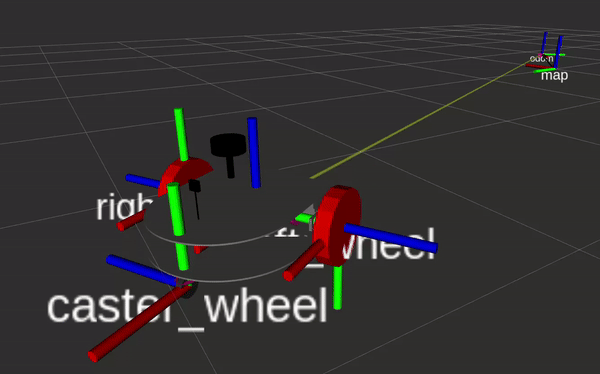

# Navigation by Adaptive Monte Carlo (AMC) Path Planning

## AMC Path Planning Method and Working Principle
Adaptive Monte Carlo (AMC) is a random path planning algorithm and is very effective in finding solutions to navigation problems in uncertain and complex environments. AMC uses the sampling-based approach of the Monte Carlo method. This method performs random sampling to determine possible solutions for a certain situation.

The basic principle of AMC is to explore different alternatives for a path. This is achieved by exploring a broad range of potential path plans through sampling. Then these potential path plans are evaluated based on certain goals or criteria. As a result of this evaluation, the path plan determined as the most suitable option is selected.

During the sampling process, AMC continuously updates the state-space sampling distribution. This distribution determines the areas that the sampling process will focus on, making the sampling process more efficient. The continuous updating of this distribution allows AMC to adapt quickly to changes in the environment and manage uncertainties.

In the navigation stage, we generate an instantaneous speed control signal by dynamically finding the best route between two points without colliding with obstacles. Robot phases schematic around navigation can be seen in the below figure. It is important to provide exact mapping and localization as well as robot descriptions for AMC algorithms to work as.

    

<em>Schematic of the robot's phases around navigation</em>

## Advantages and Disadvantages of AMC
One of the main advantages of AMC is its ability to perform effectively in complex and uncertain environments. Being a sampling-based approach, AMC can effectively model the transition from large or high-dimensional state spaces. Additionally, its ability to adapt to uncertainties and sudden environmental changes makes this method ideal for use in dynamic environments.

On the other hand, one of the main disadvantages of AMC can be the computation cost. Large sampling spaces, especially for higher-dimensional state spaces, may require significant computational power. Also, AMC's performance depends on the quality of the sampling distribution, which often needs to be adapted to a specific problem.

## Choosing AMC over Other Methods
Since the ability to work in uncertain and dynamic environments is of vital importance for the vehicle's task, AMC is the path planning algorithm chosen for our robot. Compared to other algorithms, AMC generally performs better in more complex environments and adapts better to uncertainties and sudden environmental changes. Also, AMC's compatibility with ROS2 is another reason for selection.

## Compatibility of AMC with ROS2
We use the Nav2 ROS package. In this algorithm, a non-classical control approach (dynamic window approach) is used.

ROS2 comes with the Nav2 package that supports a range of path planning algorithms, including AMC. This makes it easier for us to use ROS2 to program and control our robot. The integration of AMC with the Nav2 package allows us to effectively combine the robot's abilities to perceive its environment, plan paths, and move.

**It is important that** localization and mapping are performed sharply in this part. Also, details such as the **inertial parameters of the robot's mechanical model and the robot's joints** must be provided.

    

<em>Transforms of joints are created by Nav2</em>

## ROS2 Nav2 Package
DustbusterAI uses the Nav2 package for path planning, customizing and optimizing it for our purposes. In our project, path planning is primarily used to provide navigation to points (in general route) obtained from the genetic algorithm. In addition, secondly, the Nav2 package is utilized to determine the distances between points for the genetic algorithm used to solve the TSP problem.

Nav2 works together with the cartographer and draws a global navigation map around the walls as you can see. The local navigation map operates around the vehicle. Thus, with the Adaptive Monte Carlo algorithm, the next speed signal is determined according to dynamic environmental conditions. 

In this video, we test the success of the navigation algorithm by giving the position manually. I put a new obstacle into the environment in Gazebo, but the route is changed immediately as soon as it is detected and the obstacle is avoided.

    

<em>Optimized performance of Nav2</em>

## ROS2 Nav2 Package and AMC Integration
The ROS2 Navigation 2 (Nav2) package is a modern and modular navigation framework compatible with ROS2. Nav2 consists of a series of plugin-based subsystems that work together to perform navigation tasks. Subsystems include different modules for global and local path planning, path tracking, speed control, mapping, and other tasks. Nav2's modular design offers the ability to change these modules as needed and for users to create customized navigation solutions.

Nav2 has integrated the Adaptive Monte Carlo (AMC) method into its path planning module. AMC's integration with Nav2 provides the ability to manage uncertainties and complexity in the environment quickly and efficiently. This integration greatly enhances the robot's overall path planning and navigation capabilities.

## Global and Local Maps
Nav2 creates additional maps in line with the path plan to be generated and provides a very effective solution by running these maps together. These are referred to as global and local maps. The global map is usually created once and used as a reference for the robot's general navigation. This map contains environmental information at the very beginning, i.e., when the robot is still at the starting point, and is usually static. The local map, on the other hand, represents the robot's instant environmental perception and movements and is generally dynamic. The local map is used to adapt quickly to changes in the environment. The adaptive feature of the navigation algorithm comes from here. Nav2 enhances the robot's navigation capabilities with its ability to switch between global and local maps.

## Nav2 Tolerances and Adjustable Structure
Nav2 allows users to adjust various navigation parameters and tolerances. These parameters include path planning speed, path tracking sensitivity, goal reaching tolerance, collision prevention parameters, and more. These parameters and tolerances allow the user to adjust navigation tasks and behaviors to optimize navigation performance and reliability. This feature increases Nav2's ability to adapt to various application scenarios and environmental conditions.

