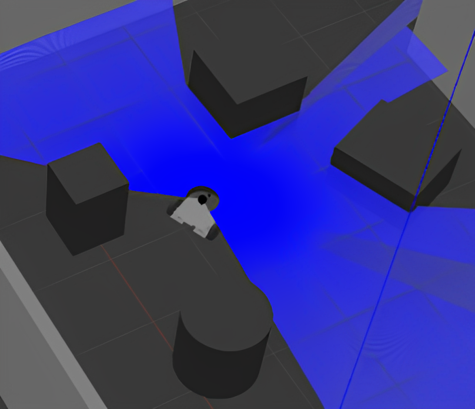

# DustBusterAI 1.0 Software Overview

DustBusterAI 1.0 is built on the ROS2 framework for the development of a fully autonomous robotic application capable of moving in large and diverse areas. In a wide range of fields, such as maze-like or track-based environments, the software's primary function is to enable the robot to effectively navigate and cover the entire area. This is achieved through the robot's ability to make autonomous decisions and determine movement waypoints in a dynamic environment. Artificial intelligence techniques are employed, particularly on data collected by the robot's environmental sensors, to understand its surroundings and identify the most suitable section of the area to navigate. These features ensure that the robot can successfully continue its mission even in challenging and unexpected situations.

## Path Planning and Decision Mechanism

Path planning and adaptive path planning techniques, which are fundamental elements of DustBusterAI 1.0 software, utilize sensor data to understand the world around the robot and apply it as an effective motion strategy.

The initial stage is environmental understanding, which is accomplished through a combination of environmental perception technology and ROS packages. The robot's sensors continuously scan its surroundings and transmit this data to ROS packages used for mapping the environment and determining the robot's position. This understanding helps the robot create a map of the environment it is in and establish its location.

Subsequently, the visible traversable area is divided into waypoints. Each waypoint is considered a potential target for the robot's navigation. The efficient traversal of all these waypoints becomes a Traveling Salesman Problem (TSP). This means the robot must cover all waypoints while minimizing the total distance traveled.

To solve the TSP problem, DustBusterAI 1.0 utilizes a genetic algorithm developed specifically for this purpose. The genetic algorithm mimics the basic principles of natural evolution; mutation, crossover, and selection are used to find the optimal solution. This process allows the solution to become increasingly efficient over time, ultimately assisting the robot in determining its navigation paths. This approach guarantees an effective navigation process by optimizing the robot's traversal. The genetic algorithm is a biological control and optimization mechanism that applies evolutionary principles.

Finally, navigation to the points obtained from solving the TSP problem is facilitated. Adaptive path planning techniques enable the robot to operate effectively in dynamic and uncertain environments. The robot's path planning and navigation capabilities are continuously updated and adapted as environmental conditions change and new sensor data arrives. This allows the robot to quickly and effectively respond to various situations, maximizing operational efficiency.

    

<em>Genetic solution of set of waypoints</em>

## Navigation and Motor Control

After determining the waypoints, DustBusterAI's navigation and motor control functions come into play. These modules determine the appropriate motor driver commands to enable the robot to reach its navigation goals. Navigation involves determining the optimal route to reach the specified targets, while motor control involves determining how the motors should be driven to follow this route. This process is carried out using classical PID control techniques, ensuring the robot reaches its goals safely and efficiently.

## Current Limitations and Future Developments

In the current version of DustBusterAI 1.0, the robot relies solely on LIDAR sensors that can observe in the 2D plane. This means the robot can only detect objects in the shapes created with extrusion of 0-degree angular from its lower plane upwards. This limits the effectiveness of DustBusterAI to environments with this type of configuration. However, future versions will enhance 3D mapping capabilities by incorporating ultrasonic sensors, allowing DustBusterAI to operate effectively in more complex and diverse environments.

    

<em>Obstacle shapes that robot achieves best success</em>

---

**For more detailed information** about the software we developed under ROS2 framework, including its components, features, and implementation details, please keep reading the other software documents or you can visit our Robotics repository below.

[DustBusterAI-Software](https://github.com/onur-ulusoy/DustBusterAI-Software)
