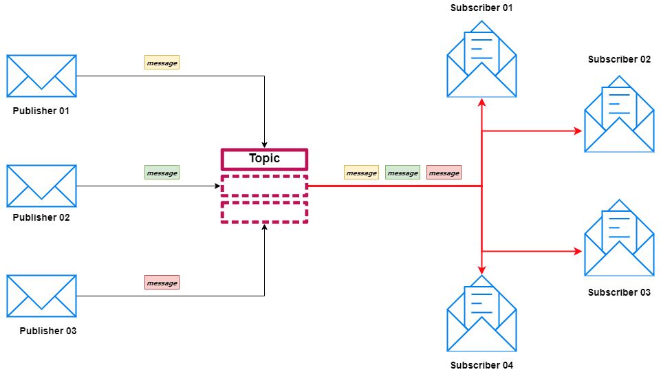
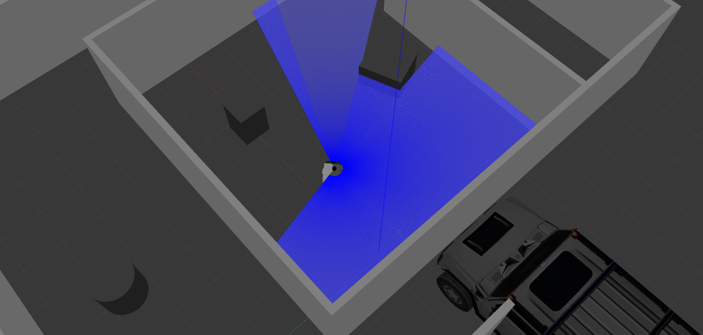

# ROS2 Software Framework

## Overview

ROS2 (Robot Operating System 2) is a software framework that facilitates the development and management of complex robotics applications. The goal of ROS2 is to simplify and standardize the process of robotic software development. It offers features such as hardware abstraction, low-level device control, application packages providing commonly used functionality, message passing, and package management.

## Modular Architecture

The modular architecture of ROS2 simplifies the development and integration of components in complex robotics applications. This approach involves developing each module to perform a specific function and communicate with other modules that need to work together. Modules can host various algorithms and processes to achieve the defined goals.

## Publish/Subscribe Communication Model

ROS2 uses a publish/subscribe model to manage communication between components. In this model, messages are published on specific topics and received by nodes that subscribe to these topics. This approach is highly effective in organizing and managing data flow within the system.

Logic of publisher - subscriber pattern communication is shown in the illustration below. Please visit [BMC Software](https://www.bmc.com/blogs/pub-sub-publish-subscribe/) or [ROS2 documentation pages](https://docs.ros.org/en/humble/index.html) for further knowledge about the pattern.

<em>Subscriber Publisher Communication Pattern Logic [Illustration by BMC Software]</em>

## Gazebo and Hardware Abstraction

Gazebo is a robot simulation environment that, when used with ROS2, enables the creation of complex simulations of real-world scenarios. The hardware abstraction feature allows Gazebo to be used as a general platform for various robot designs and hardware components. This enables software developers to program and test robot systems without requiring detailed knowledge of specific hardware components.

<em>Gazebo Environment</em>

