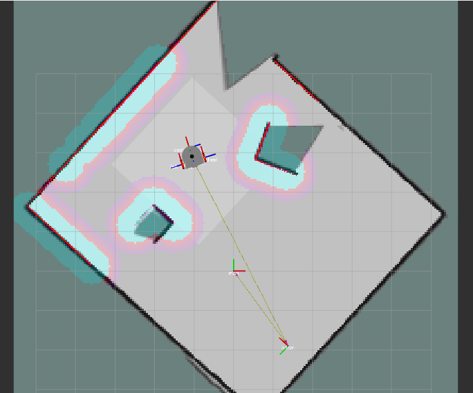

# ROS2 Software Framework

## Overview

ROS2 (Robot Operating System 2) is a software framework that facilitates the development and management of complex robotics applications. The goal of ROS2 is to simplify and standardize the process of robotic software development. It offers features such as hardware abstraction, low-level device control, application packages providing commonly used functionality, message passing, and package management.

## Modular Architecture

The modular architecture of ROS2 simplifies the development and integration of components in complex robotics applications. This approach involves developing each module to perform a specific function and communicate with other modules that need to work together. Modules can host various algorithms and processes to achieve the defined goals.

## Publish/Subscribe Communication Model

ROS2 uses a publish/subscribe model to manage communication between components. In this model, messages are published on specific topics and received by nodes that subscribe to these topics. This approach is highly effective in organizing and managing data flow within the system.

Logic of publisher - subscriber pattern communication is shown in the illustration below. Please visit [BMC Software](https://www.bmc.com/blogs/pub-sub-publish-subscribe/) or [ROS2 documentation pages](https://docs.ros.org/en/humble/index.html) for further knowledge about the pattern.

<em>Subscriber Publisher Communication Pattern Logic [Illustration by BMC Software]</em>

## Gazebo and Hardware Abstraction

Gazebo is a robot simulation environment that, when used with ROS2, enables the creation of complex simulations of real-world scenarios. The hardware abstraction feature allows Gazebo to be used as a general platform for various robot designs and hardware components. This enables software developers to program and test robot systems without requiring detailed knowledge of specific hardware components.

<em>Gazebo Environment</em>

## Rviz and Visualization

The ROS2 framework includes a 3D visualization tool called Rviz. Rviz visually represents data from robot sensors, aiding users in understanding the robot's state and its surroundings. This feature greatly facilitates the understanding and debugging of complex robotic systems.

    

<em>Sensor data observation in RViz Tool</em>

## Advantages of ROS2

ROS2 offers users a range of significant advantages. Firstly, it enhances code reusability. ROS2 provides a set of standardized libraries and tools, allowing users to quickly integrate pre-built versions of commonly used features for robotic systems. This accelerates the application development process and simplifies code maintenance and debugging.

Secondly, ROS2 makes complex robotic systems manageable. With ROS2's nodes and services, users can break down complex robotic systems into a series of interconnected modules. This modular approach enables independent development, testing, and optimization of each module. It facilitates isolating system errors and enables efficient communication between systems.

Thirdly, ROS2's scalability offers an excellent solution for scaling up the size and complexity of robot systems. It opens up possibilities for developing larger and more complex robotics applications, allowing users to adapt robots for a broader range of tasks. The combination of these features enables rapid development and deployment of robot systems, resulting in cost and time savings.

---

**For more detailed information** about the software we developed under ROS2 framework, including its components, features, and implementation details, please keep reading the other software documents or you can visit our Robotics repository below.

[DustBusterAI-Software](https://github.com/onur-ulusoy/DustBusterAI-Software)
