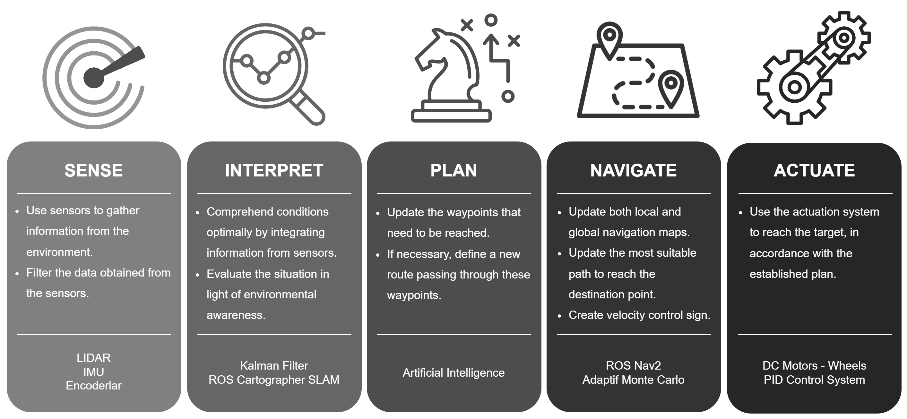
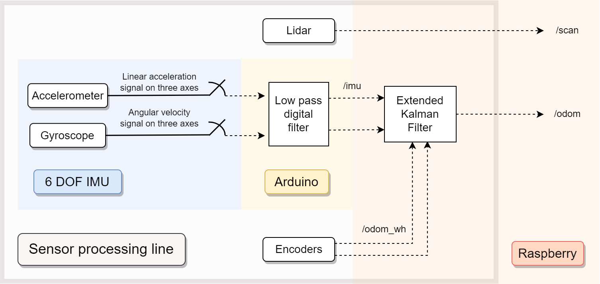
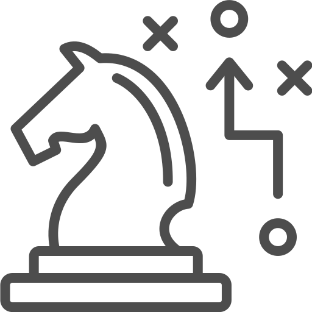
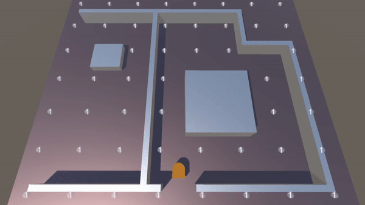
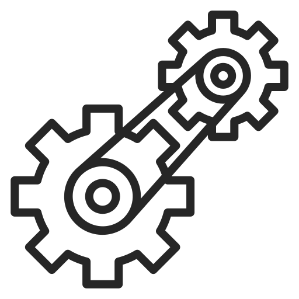
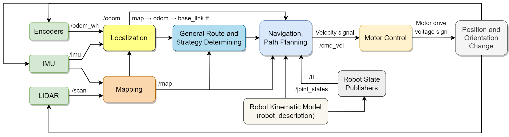

# DustBusterAI

    

<picture>    </picture>

    

<picture>    </picture>

## Table of Contents

- [DustBusterAI](#dustbusterai)
  - [Table of Contents](#table-of-contents)
  - [Project Overview](#project-overview)
  - [Autonomous Overview](#autonomous-overview)
    - [Sense](#sense)
    - [Interpret](#interpret)
    - [Plan](#plan)
    - [Navigate](#navigate)
    - [Actuate](#actuate)
    - [Overall](#overall)
  - [Sub-repositories](#sub-repositories)
  - [Project Goals](#project-goals)
  - [Project Team \& Academic](#project-team--academic)
  - [Technologies Used](#technologies-used)
  - [Project Timeline](#project-timeline)
  - [Project Budget](#project-budget)
  - [Donate \& Join the Team](#donate--join-the-team)
  - [Project Challenges](#project-challenges)
  - [Project Status](#project-status)
  - [Algorithm Simulations](#algorithm-simulations)
  - [License](#license)
  - [Acknowledgements](#acknowledgements)
  - [Conclusion](#conclusion)

## Project Overview
DustBuster is an AI-powered full autonomous differential vehicled robot that is designed to clean plain floors in wide areas such as airports in the possible shortest period of time. DustBuster is equipped with advanced path planning, decision-making, and optimal motion control algorithms that enable it to navigate through complex environments while avoiding obstacles. Its powerful electric motors and durable wheels allow it to move quickly and efficiently across large areas, while its integrated cleaning system ensures that every nook and cranny is thoroughly cleaned. Vehicle electronics including hardware, firmwares, and sensor system is designed with efficiency and reliability in mind, as the robot needs to be able to operate for extended periods of time without interruptions. This requires careful power management and fault tolerance design.

DustBusterAI uses the Robot Operating System 2 (ROS2), the well known and effective framework, to implement AI-based cleaning solutions for the robot. It employs simulation and monitoring platforms, Gazebo and RViz, for efficient development. 

In addition to its autonomous capabilities, DustBuster also offers a range of features that make it easy to use and maintain. Its intuitive interface allows operators to monitor its progress and adjust settings as needed, while its modular design makes it easy to replace worn components and perform routine maintenance tasks.

Overall, DustBuster represents a significant advancement in the field of autonomous cleaning robots, offering a powerful, efficient, and user-friendly solution for cleaning large areas quickly and effectively.

## Autonomous Overview

    

The autonomous architecture of our DustBuster robot consists of five primary stages: perception, interpretation, planning, and navigation, followed by the actuation or motor drive stage. Detailed documentation of each of these stages can be found in the corresponding project folders and they are summarized below subsections.

<picture>    </picture>

    

### **Sense**

In the perception or sensing stage, the robot collects data from various sensors. We first employ a 2D Lidar. This sensor utilizes a laser beam within a 240-degree field of view to detect structures in the environment in two dimensions. Next in line are the encoders, which provide information about the vehicle's location by determining the degree of wheel rotation. Finally, the Inertial Measurement Unit (IMU) assists and provides reliability to the other sensors by detecting the vehicle's instant motion.

Raw data obtained is often noisy and may contain outliers or irrelevant information. To ensure the quality and reliability of the data, we employ various filtering techniques to reduce the noise and enhance the valuable information. 

For a deeper dive into DustBuster's sensing mechanisms, please refer to the following resources:

- [Electronics Documentations](/Project%20Documentations/Detailed%20System%20Components/Electronics) offer detailed insights into the sensors and their configurations that enable DustBuster's operation.
- [Electronics Repository](https://github.com/onur-ulusoy/DustBusterAI-Electronics) houses the electronic design files and code that power DustBuster's sensor systems.

<picture>    </picture>

    

### **Interpret**

The next stage is interpretation. In this stage, the processed sensor data is evaluated to gain an understanding of the robot's environment. This process aim to create environmental awareness for the robot. It answers critical questions like, "Where am I currently located?", "What obstacles are present in my surroundings?", and so on.

We combine sensor data for localization and mapping, thereby obtaining more precise and reliable information. Initially, we determine the vehicle's current position by passing encoder and IMU data through a Kalman filter. We then utilize the Lidar data directly to generate the map.

Sensing & Interpretation stages can be summarized with below schematic.

    

<em>Sensing & Interpretation Stages Schematic</em>

For a comprehensive understanding of the interpretation process, kindly refer to the following detailed documentations:

- [Odometry](/Project%20Documentations/Detailed%20System%20Components/Software/1-Odometry/Odometry.md) provides information on how the robot's current position is computed.
- [Mapping](/Project%20Documentations/Detailed%20System%20Components/Software/2-Mapping/Mapping.md) explains how Lidar data is utilized to generate the map.
- [Localization](/Project%20Documentations/Detailed%20System%20Components/Software/3-Localization/Localization.md) expounds on the combination of sensor data for precise localization.
- [Software Repository](https://github.com/onur-ulusoy/DustBusterAI-Software) provides a broader view of the entire software of autonomous system with the source code.

<picture>    </picture>

    

### **Plan**

We then proceed to the planning stage. Using artificial intelligence algorithms and map data, we determine the general route that the robot will take. The goal here is to find the optimal path that ensures efficiency and safety while achieving the desired cleaning objectives.

We use evolutionary algorithms to determine the optimal path at specified time stamps according to the situation. It can be seen in the below simulation the optimal path determination at the initial state of the robot in Unity platform.

    

<em>Route Determined by Genetic Algorithm Visualized in Unity Platform</em>

- [AI Overview](/Project%20Documentations/Detailed%20System%20Components/Software/4-Artificial%20Intelligence/AI%20Overview.md): An overview of the AI systems in DustBuster.
- [Genetic Algorithm](/Project%20Documentations/Detailed%20System%20Components/Software/4-Artificial%20Intelligence/Genetic%20Algorithm.md): A detailed look into how we utilize genetic algorithms for path planning.
- [Unity Simulation](/Simulations/DustBusterAI%20Unity%20Simulation/): Our simulation environment built on Unity to develop and test evolutionary algorithms.
- [Software Repository](https://github.com/onur-ulusoy/DustBusterAI-Software): Access to the codebase that powers DustBuster's software systems.

<picture>    </picture>

    

### **Navigate**

Following planning, we reach the navigation stage. Here, the paths to the planned waypoints are generated, producing real-time velocity commands for the robot. This stage ensures the smooth and accurate execution of the planned route, responding dynamically to any changes in the environment.

Below is a video demonstration showcasing how DustBuster operates within an environment that is completely unknown to it initially.

    

<em>Demonstration of Route Navigation via Genetic Algorithm in Gazebo Simulation</em>

For a more thorough understanding of our navigation approach, consider checking out the following resources:

- [Navigation Overview](/Project%20Documentations/Detailed%20System%20Components/Software/5-Navigation/Navigation%20Overview.md): An overview of DustBuster's navigation systems.
- [Navigation Detailed](/Project%20Documentations/Detailed%20System%20Components/Software/5-Navigation/Navigation.md): An in-depth examination of our navigation processes.
- [Software Repository](https://github.com/onur-ulusoy/DustBusterAI-Software): Access to the codebase that powers DustBuster's software systems.
  
<picture>    </picture>

    

### **Actuate**

The final stage in DustBusterAI's autonomous architecture is motor drive or actuation. Here, the velocity command generated during the navigation phase is converted into a voltage signal suitable for the DC motor. This is achieved using a digital PI-PD controller embedded within the Arduino, a development that highlights the critical role of control theory in our design process. Leveraging tools like Matlab and Simulink, we've ensured the controller is well-tuned to provide efficient, responsive, and robust actuation. The result is a robot that settles to desired commands quickly, without overshoots, and remains stable across a range of conditions.

The efficacy of our controller design can be appreciated in the real-time wheel speed graph produced by the system. The following image demonstrates the performance of DustBusterAI's motor control in real-world conditions:

    

<em>Real-time Wheel Speed Graph</em>

For in-depth information on our controller design and motor actuation strategies, refer to the following resources:

- [Control System Design](https://github.com/onur-ulusoy/DustBusterAI-Electronics/Documentation/Control%20System%20Design.md) - Comprehensive documentation detailing the system model and our controller design process.
- [Motor Control Overview](/Project%20Documentations/Detailed%20System%20Components/Electronics/5-Motor%20Control/Motor%20Control.md) - An overview of the motor control strategy for DustBusterAI.
- [Electronics Repository](https://github.com/onur-ulusoy/DustBusterAI-Electronics) - Comprises the Arduino codebase, including the implemented digital controllers, as well as the Simulink files and design documents for our control system.

<picture>    </picture>

### **Overall**
The entire operation of DustBusterAI, our robot, is a carefully coordinated process where multiple subsystems work together to achieve autonomous cleaning. The block diagram provided below offers a clear picture of how these different subsystems interact and work together in a step-by-step manner, from initial sensing of the environment, through interpretation of data and route planning, to navigation and final actuation of the motors.

To understand the details of this process and the design decisions made along the way, we invite you to explore our main and sub-repositories, as well as the extensive documentation provided for each subsystem. These resources will offer a comprehensive understanding of the inner workings of DustBusterAI.

    

## Sub-repositories
[DustBusterAI](https://github.com/onurulusoy4/DustBusterAI)
(this) is the main repository of the project and contains general planning, documentation, management and visualisation. 

Sub-repositories are,
- [**DustBusterAI-Software**](https://github.com/onur-ulusoy/DustBusterAI-Software) Contains all the software codebase of DustBusterAI running on the embedded computer. It includes the ROS packages, autonomous navigation and control algorithms, sensor fusion codes, AI-based path planning and all other necessary software that powers the robot's intelligence and autonomy.
- [**DustBusterAI-Electronics**](https://github.com/onur-ulusoy/DustBusterAI-Electronics) This repository houses the embedded firmware codebase, electronic design and control systems of the DustBusterAI. It covers the embedded systems, circuit schematics, wiring diagrams, motor control systems, and sensor interfaces. This is where the physical aspects of the robot - motor controls, sensors, power management, and overall electronics - are managed and documented.

Note that, as DustBusterAI continues to evolve, new sub-repositories may be created to cater to evolving project needs. This could include a dedicated repository for advanced artificial intelligence algorithms, robot monitoring written in Java, or a repository for a web interface built using ASP.NET. Be sure to follow our GitHub for the latest project updates.

## Project Goals
The goals of the DustBusterAI project in the initial phase are:

- To create, optimize and visualize the algorithms in simulation platforms (Unity, Gazebo)
- To make algorithms to run on ROS environment
- To develop and integrate sensors and feedback mechanisms
- To design required hardwares and firmwares
- To find effective cleaning solutions and improve the mechanical design through this way
- To design and build a working prototype of the robot
- To develop a user-friendly interface for monitoring the robot

## Project Team & Academic
The DustBusterAI project is being developed by a team of engineering students. The team includes:

- [Onur Ulusoy](https://github.com/onur-ulusoy/)  (Software, Electronics, Control Systems Developer)
- Kemal Turan (Mechanical Designer)
- Efecan Becer (Mechanical Designer)

A part of this project has been developed as an academic research within the [**Autonomous Systems Research Laboratory**](https://otonom.itu.edu.tr/index_e.htm) at our university. 

The development and progress of the project were carefully monitored and guided by our esteemed faculty member, [**Prof. Dr. Erdinç Altuğ**](https://web.itu.edu.tr/altuger/). His invaluable insights and direction were instrumental in achieving the objectives of this project.

For academic insights, mechanical designs, manufactured items, theses, presentations, and publications related to this project, please visit our [Project Documentations](/Project%20Documentations).

## Technologies Used

In the development of DustbusterAI, we benefit a wide array of technologies across different disciplines. Here is a categorised breakdown:

### Software Development:

- [Visual Studio Code](https://code.visualstudio.com/): A powerful source code editor with essential addons, providing an impeccable development experience.

- [ROS2 framework](https://docs.ros.org/en/humble/index.html): An open-source, flexible, and easy-to-use software framework for robotics.

- [Gazebo](http://gazebosim.org/): A powerful 3D robotics simulator that accurately and efficiently simulates populations of robots in complex indoor and outdoor environments.

- [Ubuntu Server OS 22.04](https://ubuntu.com/download/server): A reliable, high performance server operating system has high compability with ROS.

- [Git](https://git-scm.com/): A distributed version control system for tracking changes in source code during software development.

- [Doxygen](http://www.doxygen.nl/): A tool for generating documentation from annotated source code, providing a streamlined and efficient way to keep the documentation consistent with the code base.

### Electronics and Firmware Development:

- [Arduino IDE](https://www.arduino.cc/en/software): An open-source electronics platform for easy-to-use hardware and software, perfect for our firmware development.

- [Logic Analyzer Software from Saleae](https://www.saleae.com/): Software to view, measure, and analyze signals for electronics prototyping and production.

### Control System Design:

- [Matlab and Control System Toolbox](https://www.mathworks.com/products/control.html): High-level language and interactive environment used for numerical computation, visualization, and programming. The Control System Toolbox provides algorithms and apps for systematically analyzing, designing, and tuning linear control systems.

- [Matlab Simulink](https://www.mathworks.com/products/simulink.html): Block diagram environment for multidomain simulation and Model-Based Design. It supports system-level design, simulation, automatic code generation, and continuous test and verification of embedded systems.

### Algorithm Simulation:

- [Unity Engine](https://unity.com/): A versatile game development platform used for algorithm simulation and visual representations.

### Mechanical Design:

- [Autodesk Fusion360](https://www.autodesk.com/products/fusion-360/overview): An integrated CAD, CAM, and CAE software for product and industrial design.

- [Autodesk CFD](https://www.autodesk.com/products/cfd/overview): A computational fluid dynamics software that provides fast, accurate, and flexible fluid flow and thermal simulation tools.

- [Ultimaker Cura](https://ultimaker.com/software/ultimaker-cura): A powerful, easy-to-use 3D slicer application to prepare models for 3D printing.

- [Creality CR-10 S4](https://www.creality.com): A high-precision, large-format 3D printer used to fabricate mechanical parts of the DustBusterAI robot.

### Schematic and Graphic Design:

- [Drawio](https://www.diagrams.net/): A free online diagram software for making flowcharts, process diagrams, org charts, UML, ER, and network diagrams.

- [Adobe Photoshop](https://www.adobe.com/products/photoshop.html): A raster graphics editor developed and published by Adobe Inc.

### Video Editing:

- [Davinci Resolve](https://www.blackmagicdesign.com/products/davinciresolve/): A revolutionary tool for video editing, color correction, audio post production, and visual effects.

### Supportive:

- [GPT 3.5 (Davinci) and 4 models from OpenAI](https://www.openai.com/): Powerful language models that utilize deep learning techniques to generate human-like text, enabling natural language processing and understanding.

## Project Timeline
- Q1 2023: Begin algorithm development and optimization in simulation environments, start designing electronic and mechanical design
- Q2 2023: Integrate sensors and feedback mechanisms, continue algorithm development and optimization in ROS environment, improve mechanical design based on testing results, get manufactured the required hardware and mechanical parts 
- Q3 2023: Complete algorithm development and optimization, design and build a working prototype of the robot, begin development of user-friendly interface for monitoring the robot

- Q4 2023: Finalize user-friendly interface, perform testing and debugging, prepare for potential launch or deployment of the DustBusterAI robot.

## Project Budget

The project budget for DustBusterAI is estimated for the first prototype to be $650, including costs for materials, components, hardware and firmware development, software development, algorithm optimization, and prototype testing. This budget will be allocated across the different phases of the project according to the timeline outlined above.

It's worth noting that not all items were purchased at the academic timeline of the project, as they were already available in the laboratory. For further details, please refer to the [Bill of Materials](/Bill%20of%20materials/) 

## Donate & Join the Team
Donate or Join to Support the DustBusterAI Project.

We are having economic burdens in our country which usually result in the necessary materials or manufacturing fees such as PCB production or 3D printing to be overpriced.
We rely on the support of donors like you to bring the DustBusterAI project to develop further. Your contribution will help us purchase the necessary equipment and materials to build a working prototype of the robot, or if you are interested in and eager to develop this project, you can **join our team** for the further development of the necessary software and electronics to make it run, design of the mechanical parts to enpower the system. By donating or joining to us, you can be a part of revolutionizing the cleaning industry and making our world a cleaner, more efficient place. Thank you for your support!

Reach us out by contacting [Onur Ulusoy](https://www.linkedin.com/in/onur-ulusoy/)

## Project Challenges
The DustBusterAI project faces several difficulty, including:

- Lack of funding to the project delays in procuring or manufacturing necessary components and materials
- Difficulty in optimizing the robot's navigation and cleaning algorithms to improve efficiency and effectiveness
- Market competition from other cleaning robots and devices

## Project Status
As of June 14, 2023, the initial prototype designs of DustBusterAI are completed and we are currently in the physical prototyping stage. The software team is still in the process of developing and refining the decision-making algorithms, conducting tests using the ROS2 framework in conjunction with Gazebo and RViz platforms. The project is progressing according to the set milestones and timelines.

## Algorithm Simulations
Since most of the algorithms are handled by development team, before creating ROS environment or investing resources into building a physical prototype of a robot, it's crucial to validate the underlying algorithms that will govern its behavior. This involves simulating the robot's movements and interactions with the environment to verify that the algorithms are functioning as intended. Unity, a popular game engine and simulation platform, provides a powerful toolset for creating these simulations. By building a virtual prototype in Unity, developers can test and refine the algorithms that will ultimately drive the physical robot's behavior, without the risks and expenses associated with building and testing a physical prototype. This can help to identify and resolve potential issues early on in the development process, ensuring that the final product is as efficient and effective as possible. Once the algorithms have been thoroughly tested and optimized in the Unity simulation, developers can confidently move forward with building the physical robot.

Current unity simulation status can be checked from [Simulation Stages](/Algorithm%20Simulations/DustBusterAI%20Unity%20Simulation)

https://user-images.githubusercontent.com/95442568/222244447-768bc50f-41e9-4a67-80c4-689e2ca3722b.mp4

**Note:** Initial simulations in Unity Engine are over, we jumped into developing this algoritms in ROS environment using Gazebo and RViz tools. [DustBusterAI-Software](https://github.com/onur-ulusoy/DustBusterAI-Software)

## License

All software and hardware designs created for the DustBusterAI project are released under the [MIT License](LICENSE). This includes the source code, CAD files, and any other materials created for the project. You are free to use, modify, and distribute this project for both commercial and non-commercial purposes. However, the authors of this project make no warranties or guarantees as to the reliability, suitability, or accuracy of the materials provided. Use at your own risk.

The media files, including but not limited to graphics, videos, and other visual content, accompanying the DustBusterAI project are licensed under a separate [Restrictive License](LICENSE-MEDIA). These media files created and owned by Onur Ulusoy are the exclusive property of Onur Ulusoy and may not be used, reproduced, distributed, modified, or exploited in any manner, whether commercial or private, without explicit written permission. Unauthorized use or exploitation of the media files may result in legal action.

## Acknowledgements

We would like to take this opportunity to extend our gratitude to all those who have made significant contributions to the DustBusterAI project. This includes everyone from those who worked on the technical aspects to those who provided valuable insights and ideas.

In particular, we would like to acknowledge the exceptional work of the designers who brought our brand to life with their creative artwork. Their contributions have given DustBusterAI its unique and recognizable identity.

For a detailed list of acknowledgements, please refer to our [ACKNOWLEDGEMENTS](/ACKNOWLEDGEMENTS.md) document.

## Conclusion
The DustbusterAI project is an ambitious undertaking that aims to develop an autonomous robot capable of cleaning a room using path planning, decision making, and motion control algorithms. By utilizing the latest technologies and techniques in robotics, the project hopes to create a robot that can handle different room sizes and shapes, as well as different types of obstacles.

