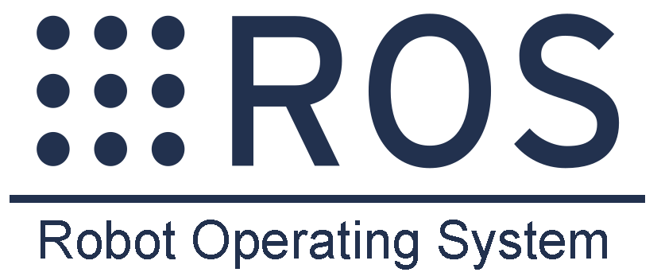
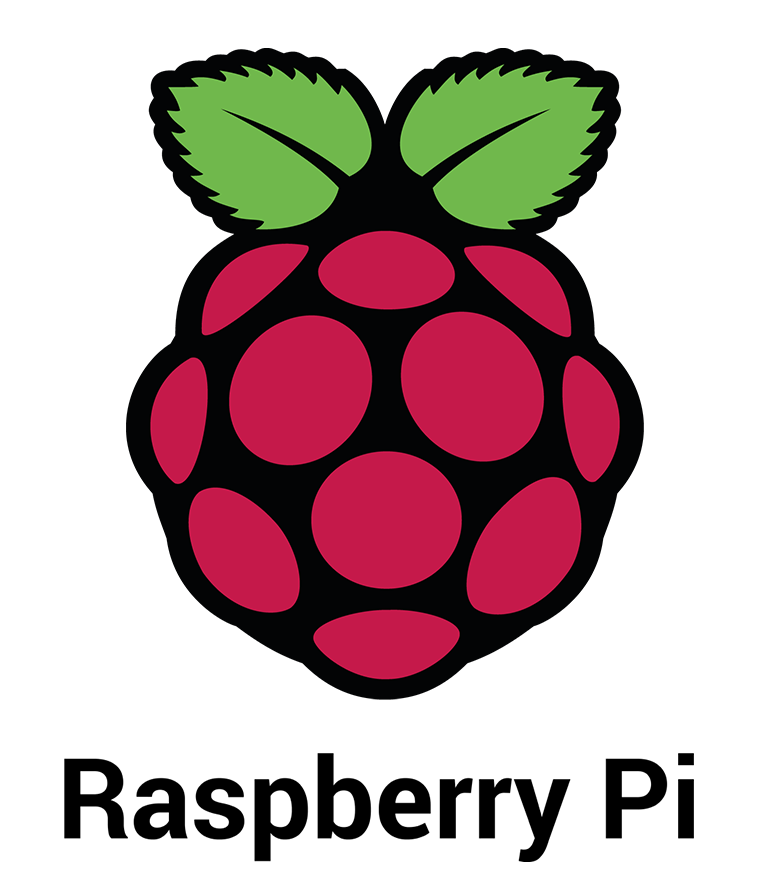
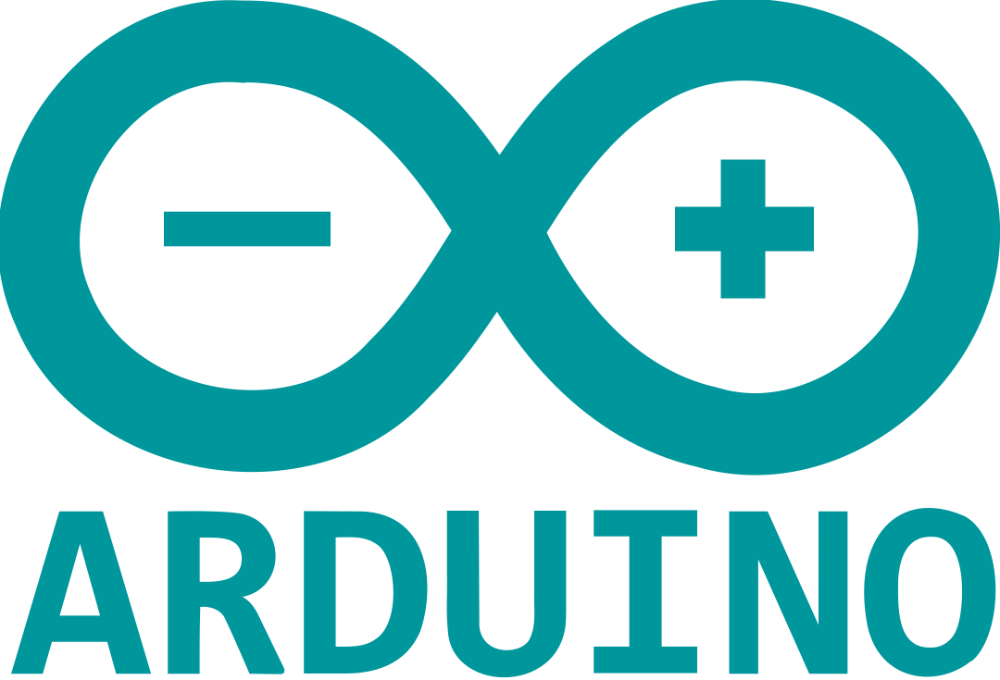

# DustBusterAI

    
    
    

 

    
    
    

 

---

    

 

---

## Table of Contents

- [DustBusterAI](#dustbusterai)
  - [Table of Contents](#table-of-contents)
  - [Project Overview](#project-overview)
  - [Sub-repositories](#sub-repositories)
  - [Project Goals](#project-goals)
  - [Project Team](#project-team)
  - [Technologies Used](#technologies-used)
  - [Project Timeline](#project-timeline)
  - [Project Budget](#project-budget)
  - [Donate](#donate)
  - [Project Challenges](#project-challenges)
  - [Project Status](#project-status)
  - [Pre Simulations](#pre-simulations)
  - [License](#license)
  - [Conclusion](#conclusion)

## Project Overview
DustBuster is an AI-powered full autonomous differential vehicled robot that is designed to clean plain floors in wide areas such as airports in the possible shortest period of time. DustBuster is equipped with advanced path planning, decision-making, and optimal motion control algorithms that enable it to navigate through complex environments while avoiding obstacles. Its powerful electric motors and durable wheels allow it to move quickly and efficiently across large areas, while its integrated cleaning system ensures that every nook and cranny is thoroughly cleaned. Vehicle electronics including hardware, firmwares, and sensor system is designed with efficiency and reliability in mind, as the robot needs to be able to operate for extended periods of time without interruptions. This requires careful power management and fault tolerance design.

DustBusterAI uses the Robot Operating System 2 (ROS2), the well known and effective framework, to implement AI-based cleaning solutions for the robot. It employs simulation and monitoring platforms, Gazebo and RViz, for efficient development. 

In addition to its autonomous capabilities, DustBuster also offers a range of features that make it easy to use and maintain. Its intuitive interface allows operators to monitor its progress and adjust settings as needed, while its modular design makes it easy to replace worn components and perform routine maintenance tasks.

Overall, DustBuster represents a significant advancement in the field of autonomous cleaning robots, offering a powerful, efficient, and user-friendly solution for cleaning large areas quickly and effectively.

## Sub-repositories
[DustBusterAI](https://github.com/onurulusoy4/DustBusterAI)
(this) is the main repository of the project and contains general planning, management and visualisation. 

Sub-repositories are,
- [DustBusterAI-Software](https://github.com/onurulusoy4/DustBusterAI-Software)
- [DustBusterAI-Control](https://github.com/onurulusoy4/DustBusterAI-Control)
- [DustBusterAI-Electronics](https://github.com/onurulusoy4/DustBusterAI-Electronics)
- [DustBusterAI-Mechanics](https://github.com/onurulusoy4/DustBusterAI-Software)

## Project Goals
The goals of the DustBusterAI project are:

- To create, optimize and visualize the algorithms in simulation platforms (Unity, Gazebo)
- To make algorithms to run on ROS environment
- To develop and integrate sensors and feedback mechanisms
- To design required hardwares and firmwares
- To find effective cleaning solutions and improve the mechanical design through this way
- To design and build a working prototype of the robot
- To develop a user-friendly interface for monitoring the robot

## Project Team
The DustBusterAI project is being developed by a team of engineering students. The team includes:

- [Onur Ulusoy](https://github.com/onurulusoy4/)
- Kemal Turan
- Efecan Becer

## Technologies Used
The following technologies will be used in the DustbusterAI project:

- Firmware development: C and C++ for programming the embedded systems of the robot
- ROS-based software development: C++, Python for developing the software that runs on the robot's onboard computer
- Simulation and visualization: Unity C# and Gazebo for creating a realistic virtual environment to test the robot's behavior
- Version control: Git for tracking changes and managing collaboration among team members
- Continuous integration and deployment: tools like Jenkins or Travis CI for automating the build, test, and deployment process
- Hardware design: Altium Designer and LTSpice for designing and prototyping the robot's electronic hardware
- Communication protocols: UART, SPI, and I2C for ensuring seamless communication between the various components of the robot. Bluetooth and Wi-Fi is supported for monitoring.
- Structural 3D design and analysis: Utilizing industry-leading software such as Fusion 360 and Catia for comprehensive design, while ANSYS and Abaqus provide advanced analysis capabilities to ensure optimal structural integrity.

## Project Timeline
- Q1 2023: Begin algorithm development and optimization in simulation environments, start designing electronic and mechanical design
- Q2 2023: Integrate sensors and feedback mechanisms, continue algorithm development and optimization in ROS environment, improve mechanical design based on testing results, get manufactured the required hardware and mechanical parts 
- Q3 2023: Complete algorithm development and optimization, design and build a working prototype of the robot, begin development of user-friendly interface for monitoring the robot

- Q4 2023: Finalize user-friendly interface, perform testing and debugging, prepare for potential launch or deployment of the DustBusterAI robot.

## Project Budget

The project budget for DustBusterAI is estimated for the first prototype to be $5000, including costs for materials, components, hardware and firmware development, software development, algorithm optimization, and prototype testing. This budget will be allocated across the different phases of the project according to the timeline outlined above.
## Donate
Donate to Support the DustBusterAI Project.

We are having economic burdens in our country which usually result in the necessary materials or manufacturing fees such as PCB production or 3D printing to be overpriced.
We rely on the support of donors like you to bring the DustBusterAI project to life. Your contribution will help us purchase the necessary equipment and materials to build a working prototype of the robot, as well as fund the development of the necessary software and algorithms to make it run. By donating, you can be a part of revolutionizing the cleaning industry and making our world a cleaner, more efficient place. Thank you for your support!

To donate to our project please contact [Onur Ulusoy](https://www.linkedin.com/in/onurulusoy7/)

## Project Challenges
The DustBusterAI project faces several difficulty, including:

- Lack of funding to the project delays in procuring or manufacturing necessary components and materials
- Difficulty in optimizing the robot's navigation and cleaning algorithms to improve efficiency and effectiveness
- Market competition from other cleaning robots and devices

## Project Status
As of March 25, 2023, the DustBusterAI project is in the design and planning phase. The team is currently working on developing the robot's decision making algorithms and testing using ROS2 framework, in Gazebo and RViz platforms. The project is on track to meet its Q1 2023 deadline for completing the prototype.

## Pre Simulations
Since most of the algorithms are handled by development team, before creating ROS environment or investing resources into building a physical prototype of a robot, it's crucial to validate the underlying algorithms that will govern its behavior. This involves simulating the robot's movements and interactions with the environment to verify that the algorithms are functioning as intended. Unity, a popular game engine and simulation platform, provides a powerful toolset for creating these simulations. By building a virtual prototype in Unity, developers can test and refine the algorithms that will ultimately drive the physical robot's behavior, without the risks and expenses associated with building and testing a physical prototype. This can help to identify and resolve potential issues early on in the development process, ensuring that the final product is as efficient and effective as possible. Once the algorithms have been thoroughly tested and optimized in the Unity simulation, developers can confidently move forward with building the physical robot.

Algorithms first tested in Unity Engine and this is the main repository, not contain much another code, that's why the project is seen as C#.

Current unity simulation status can be checked from [Simulation Stages](https://github.com/onurulusoy4/DustBusterAI/tree/master/Pre-Simulations/DustBusterAI%20Unity%20Simulation)

https://user-images.githubusercontent.com/95442568/222244447-768bc50f-41e9-4a67-80c4-689e2ca3722b.mp4

**Note:** Pre Simulations in Unity Engine is over, we jumped into developing ROS environment using Gazebo and RViz tools. [DustBusterAI-Software](https://github.com/onurulusoy4/DustBusterAI-Software)

## License

All software and hardware designs created for the DustBusterAI project are released under the [MIT License](https://github.com/onurulusoy4/DustBusterAI/blob/master/LICENSE). This includes the source code, CAD files, and any other materials created for the project. You are free to use, modify, and distribute this project for both commercial and non-commercial purposes. However, the authors of this project make no warranties or guarantees as to the reliability, suitability, or accuracy of the materials provided. Use at your own risk.

## Conclusion
The DustbusterAI project is an ambitious undertaking that aims to develop an autonomous robot capable of cleaning a room using path planning, decision making, and motion control algorithms. By leveraging the latest technologies and techniques in robotics, the project hopes to create a robot that can handle different room sizes and shapes, as well as different types of obstacles.

